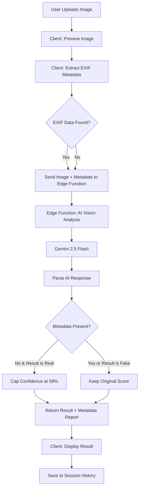
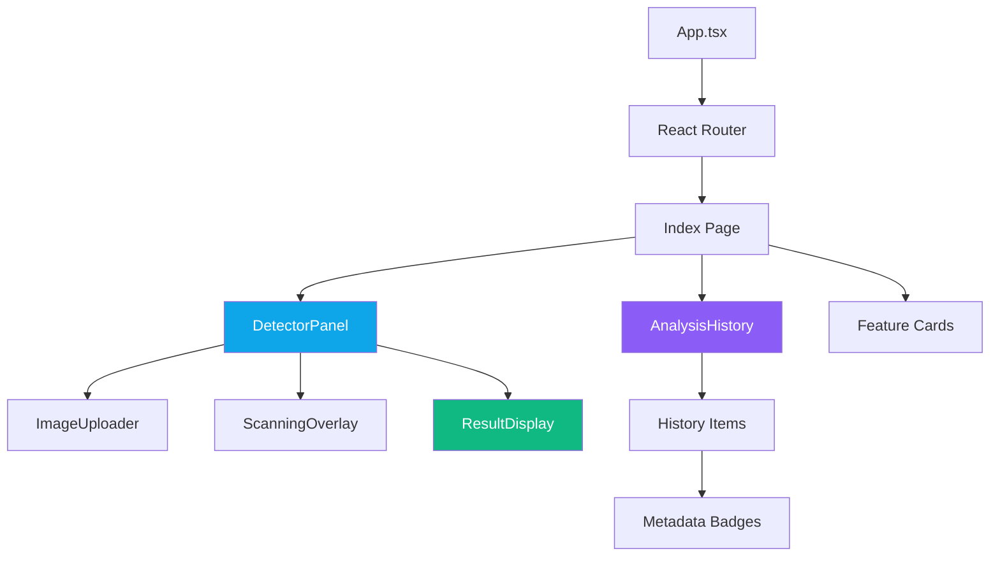

# 🛡️ DeepFake Detector

> AI-powered image authenticity analysis with EXIF metadata scanning

[](https://deepfaked.lovable.app)


---

## Overview

DeepFake Detector is a web application that analyzes uploaded images for signs of AI-generated manipulation. It combines **AI vision analysis** (Google Gemini 2.5 Flash) with **EXIF metadata inspection** to provide a confidence-scored verdict on whether an image is real or fake.

### Key Capabilities

- **Dual-layer analysis** — AI visual inspection + metadata forensics
- **Confidence scoring** — 0–100% score with automatic capping when metadata is absent
- **EXIF metadata extraction** — Client-side parsing of camera make/model, date, GPS, and software tags
- **Session history** — Track past analyses with thumbnails and metadata badges
- **Real-time scanning UI** — Animated overlay during analysis

---

## Features

| Feature | Description |
|---------|-------------|
| **AI Vision Model** | Gemini 2.5 Flash multimodal analysis for artifact detection |
| **EXIF Metadata Scan** | Extracts and evaluates image metadata — missing EXIF lowers confidence |
| **Artifact Detection** | Identifies subtle manipulation artifacts and inconsistencies |
| **Real-Time Results** | Instant analysis with animated scanning overlay |
| **Analysis History** | Session-based history with thumbnails and EXIF status badges |
| **Responsive Design** | Works on desktop, tablet, and mobile |

---

## Tech Stack

| Layer | Technology |
|-------|-----------|
| **Frontend** | React 18, TypeScript 5, Vite 5 |
| **Styling** | Tailwind CSS 3, shadcn/ui, Lucide Icons |
| **EXIF Parsing** | ExifReader (client-side) |
| **Backend** | Lovable Cloud Edge Functions (Deno) |
| **AI Model** | Google Gemini 2.5 Flash (via Lovable AI Gateway) |
| **State Management** | React hooks, TanStack React Query |
| **Routing** | React Router v6 |

---

## Architecture

### Detection Pipeline



### Component Hierarchy



---

## Project Structure

```
├── public/
│   ├── placeholder.svg
│   └── robots.txt
├── src/
│   ├── components/
│   │   ├── DetectorPanel.tsx      # Main detection orchestrator
│   │   ├── ImageUploader.tsx      # Drag & drop / file picker
│   │   ├── ScanningOverlay.tsx    # Animated scan effect
│   │   ├── ResultDisplay.tsx      # Verdict + confidence + metadata report
│   │   ├── AnalysisHistory.tsx    # Session history list
│   │   ├── NavLink.tsx            # Navigation helper
│   │   └── ui/                    # shadcn/ui components
│   ├── hooks/
│   │   ├── useAnalysisHistory.ts  # History state management
│   │   ├── use-mobile.tsx         # Responsive breakpoint hook
│   │   └── use-toast.ts           # Toast notifications
│   ├── integrations/
│   │   └── supabase/
│   │       ├── client.ts          # Supabase client (auto-generated)
│   │       └── types.ts           # Database types (auto-generated)
│   ├── pages/
│   │   ├── Index.tsx              # Landing page
│   │   └── NotFound.tsx           # 404 page
│   ├── lib/
│   │   └── utils.ts               # Utility functions (cn)
│   ├── App.tsx                    # Root component + routing
│   ├── main.tsx                   # Entry point
│   └── index.css                  # Global styles + design tokens
├── supabase/
│   ├── config.toml                # Supabase configuration
│   └── functions/
│       └── detect-deepfake/
│           └── index.ts           # Edge function for AI analysis
├── tailwind.config.ts
├── vite.config.ts
└── tsconfig.json
```

---

## How It Works

### Step-by-Step Detection Flow

1. **Image Upload** — User uploads an image via drag-and-drop or file picker. The image is converted to a base64 data URL for preview and transmission.

2. **EXIF Extraction** — Before sending to the server, the client uses `ExifReader` to parse the image's raw bytes for EXIF, IPTC, and XMP metadata:
   - Camera make & model
   - Date taken
   - GPS coordinates
   - Software used (e.g., Photoshop, DALL-E)

3. **Edge Function Processing** — The base64 image and metadata summary are sent to the `detect-deepfake` edge function, which:
   - Sends the image to **Gemini 2.5 Flash** with a specialized prompt for deepfake detection
   - Receives a structured JSON response with verdict, confidence, and reasoning

4. **Metadata Logic** — The edge function applies post-processing:
   - If EXIF metadata is **present** (camera info, date, GPS) → AI score is kept as-is
   - If EXIF metadata is **missing** and AI says "real" → confidence is **capped at 59%**
   - A `metadataReport` is generated listing what was found or missing

5. **Result Display** — The client renders:
   - Color-coded verdict badge (green = real, red = fake)
   - Confidence percentage with progress bar
   - Metadata analysis section with found/missing indicators
   - AI reasoning text

6. **History Tracking** — Results are saved to session storage with thumbnails and metadata badges for quick reference.

### Confidence Capping Logic

```
IF result == "real" AND metadata.hasExif == false:
    confidence = min(confidence, 0.59)
    reasoning += "Note: No EXIF metadata found..."
```

This ensures that images without any metadata (a common trait of AI-generated images) never receive a high "real" confidence score.

---

## Getting Started

### Prerequisites

- [Node.js](https://nodejs.org/) 18+ or [Bun](https://bun.sh/)
- A Lovable account (for the backend edge functions)

### Installation

```bash
# Clone the repository
git clone <repository-url>
cd deepfake-detector

# Install dependencies
npm install
# or
bun install

# Start the development server
npm run dev
# or
bun run dev
```

The app will be available at `http://localhost:5173`.

### Environment Variables

The following variables are automatically configured by Lovable Cloud:

| Variable | Description |
|----------|-------------|
| `VITE_SUPABASE_URL` | Backend API URL |
| `VITE_SUPABASE_PUBLISHABLE_KEY` | Public API key |

---

## Disclaimer

> **This tool provides estimates only.** Results are advisory and may not catch all AI-generated or manipulated images. Do not rely solely on this tool for critical decisions. AI detection technology has inherent limitations and both false positives and false negatives are possible.

---

<p align="center">
  Built with <a href="https://lovable.dev">Lovable</a> · Powered by AI vision models
</p>
